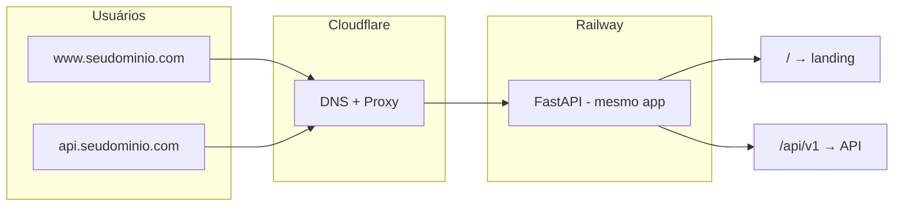

# Deploy: Railway + GitHub + Cloudflare

Plano atualizado: um único serviço (landing + API no mesmo app), deploy via GitHub na Railway, domínio no Cloudflare com subdomínios.

---

## Arquitetura

- **Um serviço Railway**: o app FastAPI serve a landing em `/` e a API em `/api/v1/...`. Um deploy, uma URL Railway (ex.: `medicamentos-api.up.railway.app`).
- **Um domínio no Cloudflare** com dois subdomínios apontando para o mesmo serviço:
  - `www` (ou `@`) → página inicial / “gerar API Key”
  - `api` → mesma URL Railway; uso típico: `https://api.seudominio.com/api/v1/...`
- **GitHub**: repo conectado à Railway; push na branch configurada = deploy automático.

---

## 1. Repo e app (o que já está no plano anterior)

- Landing estática em `/` (HTML + JS que chama `POST /api/v1/auth/keys/public`).
- Endpoint público `POST /api/v1/auth/keys/public` com rate limit por IP.
- Resto da API em `/api/v1/...` (já existe).
- Variáveis de ambiente: `DATABASE_URL` (Postgres da Railway), `SECRET_KEY`, `API_PREFIX=/api/v1`.

Nada de subdomínio no código: o app responde por path. Quem “muda” é só o DNS (subdomínios no Cloudflare).

---

## 2. Railway

1. **Conta**: [railway.app](https://railway.app) (login com GitHub).
2. **New Project** → **Deploy from GitHub repo** → selecionar `medicamentos_api`.
3. **Postgres**: no mesmo projeto, **Add Plugin** → **PostgreSQL**. Railway gera `DATABASE_URL`; usar em **Variables** do serviço da API.
4. **Variáveis do serviço** (Settings → Variables):
   - `DATABASE_URL` → copiar do plugin Postgres (ex.: `${{Postgres.DATABASE_URL}}`).
   - `SECRET_KEY` → string forte (gerar uma e colar).
   - `API_PREFIX` → `/api/v1` (se usar).
5. **Build / Start**:
   - Build: detectado por default (Python + `requirements.txt`) ou comando explícito, ex.: `pip install -r requirements.txt`.
   - Start: `uvicorn app.main:app --host 0.0.0.0 --port $PORT`. Railway injeta `PORT`; usar `$PORT` no comando.
6. **Domínio Railway**: em Settings → Networking → **Generate Domain**. Fica algo como `medicamentos-api-production.up.railway.app`. Essa URL é a “origem” única (landing + API).

Opcional: **Dockerfile**. Se você colocar um `Dockerfile` na raiz, a Railway usa ele em vez de buildpack Python; o `CMD` deve usar `$PORT` (ex.: `uvicorn ... --port 8000` e no Railway configurar `PORT=8000` ou o que eles injetarem). Para “tudo junto” e deploy simples, buildpack Python é suficiente.

---

## 3. Cloudflare (subdomínios, mesmo domínio)

Domínio já no Cloudflare (DNS gerenciado pela Cloudflare):

1. **DNS** (Cloudflare Dashboard → seu domínio → DNS → Records):
   - **www** (ou **@** para raiz):
     - Type: `CNAME`
     - Name: `www` (ou `@`)
     - Target: `medicamentos-api-production.up.railway.app` (a URL gerada pela Railway).
     - Proxy: **Proxied** (nuvem laranja) para SSL e cache.
   - **api**:
     - Type: `CNAME`
     - Name: `api`
     - Target: `medicamentos-api-production.up.railway.app` (mesma URL).
     - Proxy: **Proxied**.

Assim, `www.seudominio.com` e `api.seudominio.com` vão para o mesmo serviço Railway. O app não diferencia por host: `https://www.seudominio.com/` → landing; `https://api.seudominio.com/api/v1/medicamentos` → API (ou você pode usar `https://www.seudominio.com/api/v1/...` também).

Se quiser que a “raiz” (ex.: `seudominio.com`) também mostre a landing: criar outro record **A** ou **CNAME** para `@` apontando para a mesma origem (ou redirect de `@` para `www` nas Page Rules / Redirect Rules do Cloudflare).

---

## 4. GitHub (deploy automático)

- Repo já conectado ao projeto Railway.
- Branch: em Railway, Settings do serviço → **Source** → escolher a branch (ex.: `main`).
- A cada push nessa branch, a Railway faz build e deploy.
- Logs e variáveis: no dashboard da Railway.

Não é preciso GitHub Actions para o deploy; a Railway faz o deploy contínuo sozinha.

---

## 5. Checklist pós-deploy

1. **Migrações / schema**: o `init_db()` no startup do FastAPI cria tabelas; se precisar de dados iniciais (ex.: CSV), rodar script de import uma vez (Railway permite “one-off” run ou você roda local apontando `DATABASE_URL` para o Postgres da Railway).
2. **Primeira API Key**: se não tiver endpoint público ainda, rodar `python scripts/create_admin.py` uma vez (local com `DATABASE_URL` da Railway, ou via “Run command” no Railway se existir).
3. **Landing**: acessar `https://www.seudominio.com/` e testar “Gerar API Key” (quando o endpoint público estiver implementado).
4. **API**: `curl -H "X-API-Key: SUA_KEY" https://api.seudominio.com/api/v1/medicamentos`.

---

## Resumo

| Item | Escolha |
|------|--------|
| Hospedagem | Railway (um serviço = app + landing) |
| Deploy | GitHub (push = deploy) |
| Banco | Postgres na Railway (plugin no mesmo projeto) |
| Domínio / subdomínios | Cloudflare: `www` e `api` em CNAME para a URL Railway |
| Servidor próprio | Não; PaaS Railway |
| Docker | Opcional na Railway (buildpack Python basta para “tudo junto”) |

Tudo junto = página estática e API no mesmo domínio, diferenciando só por subdomínio (e por path). Um único backend na Railway.
